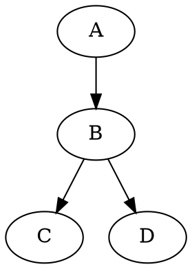
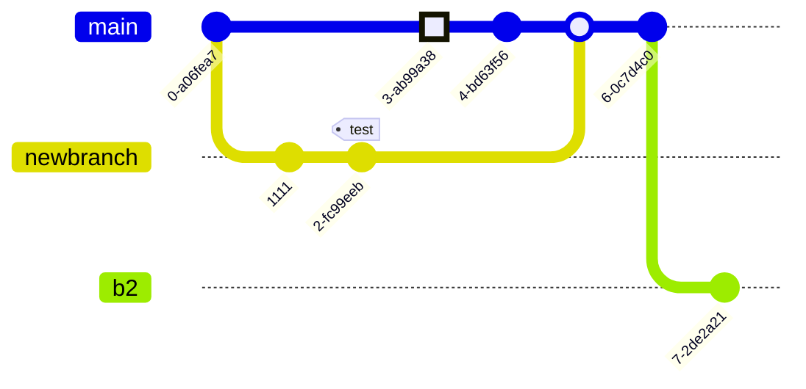
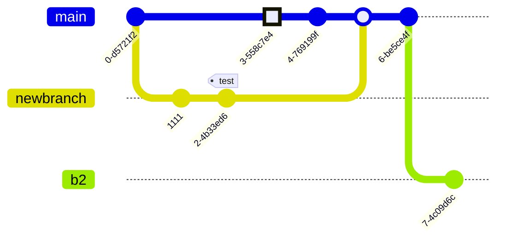
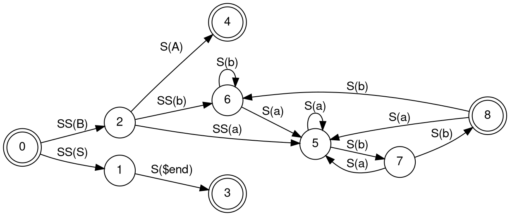

# Use `DOT language` (graph description language, part of Graphviz project) to draw tree/graph (result is `.gv` text file)

`DOT` ("DAG/Directed-Acyclic-Graph of tomorrow") is a [graph](https://en.wikipedia.org/wiki/Graph_(discrete_mathematics)) (as in *nodes* and *edges*, not as in *bar charts*) description language, developed as a part of the [Graphviz](https://en.wikipedia.org/wiki/Graphviz) project.

`DOT` graphs are typically stored as files with the `.gv` filename-extension. See [Wikipedia's DOT (graph description language)](https://en.wikipedia.org/wiki/DOT_(graph_description_language)) for details.

## Use vscode + Markdown Preview Enhanced to `DOT` preview and export

Install vscode-extension, `Markdown Preview Enhanced` (also `Markdown All in One`, `Markdownlint`, `vscode-pdf`). Set `true` to *Markdown-preview-enhanced: Enable Script Execution*.

Open an `.md` file.

Write below to the `.md` file:

````markdown

````

Then, preview with [MPE for graphviz](https://shd101wyy.github.io/markdown-preview-enhanced/#/diagrams?id=graphviz).

> \[!TIP]
> To convert to pdf, at MPE preview, *Export* → *HTML (CDN hosted)*.\
> Then, open the HTML with browser. In the browser, print to pdf.

## Use `dot` program to export `.gv` to `.svg`

`dot` command-line tool (part of Graphviz suite) can be installed using `brew install graphviz`.

The `.gv` must be like this:

```bash
$ cat inputfile.gv
digraph G {
  A -> B
  B -> C
  B -> D
}
```

Use below command to export `.gv` to `.svg`:

```bash
dot -Tsvg inputfile.dot -o digraphG.svg
```

> \[!NOTE]
> See [graphviz document](https://graphviz.org/docs/outputs/svg/) for SVG option of `dot` program.

Below is the `digraphG.svg`:\


The above `.svg` is included in `.md` (markdown) file using below syntax:

```markdown

```

> \[!WARNING]
> DO NOT USE HEADER-LESS SVG WHEN INCLUDING SVG IN MARKDOWN.\
> Use the option `-Tsvg`!!!!

## As of 2026/03/19, GitHub does not support rendering graphviz `dot` program inside `.md` file

Mermaid notation inside `.md` file is rendered correctly in GitHub webpages. So, inside an `.md` file, if you write `mermaid` notation like below:

````markdown

````

, then below *commit flow diagram* will be rendered in the GitHub page.



However, unlike `mermaid`, graphviz (`DOT language`) inside a markdown file is not rendered in the GitHub page. So, inside an `.md` file, if you write graphviz `DOT` program like below:

````markdown

````

, an example of finite automaton will NOT be rendered. The text of the `DOT` program will be shown. However, it will be rendered by VS Code's extension `Markdown Preview Enhanced`.


