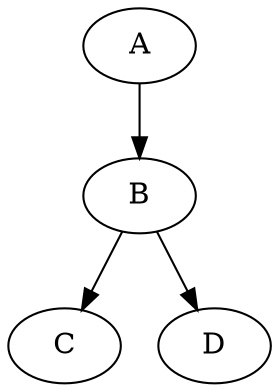
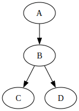

# Use `DOT language` (graph description language, part of Graphviz project) to draw tree/graph (result is `.gv` text file)

`DOT` ("DAG/Directed-Acyclic-Graph of tomorrow") is a [graph](https://en.wikipedia.org/wiki/Graph_(discrete_mathematics)) (as in *nodes* and *edges*, not as in *bar charts*) description language, developed as a part of the [Graphviz](https://en.wikipedia.org/wiki/Graphviz) project.

`DOT` graphs are typically stored as files with the `.gv` filename-extension. See [Wikipedia's DOT (graph description language)](https://en.wikipedia.org/wiki/DOT_(graph_description_language)) for details.

## Use vscode + Markdown Preview Enhanced to `DOT` preview and export

Install vscode-extension, `Markdown Preview Enhanced` (also `Markdown All in One`, `Markdownlint`, `vscode-pdf`).

Open an `.md` file.

Write below to the `.md` file:
````markdown

````

Then, preview with [MPE for graphviz](https://shd101wyy.github.io/markdown-preview-enhanced/#/diagrams?id=graphviz).

> \[!TIP]
> To convert to pdf, at MPE preview, *Export* → *HTML (CDN hosted)*.\
> Then, open the HTML with browser. In the browser, print to pdf.

## Use `dot` program to export `.gv` to `.svg`

`dot` command-line tool (part of Graphviz suite) can be installed using `brew install graphviz`.

The `.gv` must be like this:
```bash
$ cat inputfile.gv
digraph G {
  A -> B
  B -> C
  B -> D
}
```

Use below command to export `.gv` to `.svg`:
```bash
dot -Tsvg inputfile.dot -o outputfile.svg
```

Below is the `digraph G`:\


> \[!NOTE]
> See [here](https://graphviz.org/docs/outputs/svg/) for SVG option of `dot` program.

Inline svg <!-- Generated by graphviz version 14.1.2 (20260124.0452)
 -->
<!-- Title: G Pages: 1 -->

<svg width="134pt" height="188pt"
 viewBox="0.00 0.00 134.00 188.00">
<g id="graph0" class="graph" transform="scale(1 1) rotate(0) translate(4 184)">
<title>G</title>
<polygon fill="white" stroke="none" points="-4,4 -4,-184 130,-184 130,4 -4,4"/>
<!-- A -->
<g id="node1" class="node">
<title>A</title>
<ellipse fill="none" stroke="black" cx="63" cy="-162" rx="27" ry="18"/>
<text xml:space="preserve" text-anchor="middle" x="63" y="-156.95" font-family="Times,serif" font-size="14.00">A</text>
</g>
<!-- B -->
<g id="node2" class="node">
<title>B</title>
<ellipse fill="none" stroke="black" cx="63" cy="-90" rx="27" ry="18"/>
<text xml:space="preserve" text-anchor="middle" x="63" y="-84.95" font-family="Times,serif" font-size="14.00">B</text>
</g>
<!-- A&#45;&gt;B -->
<g id="edge1" class="edge">
<title>A&#45;&gt;B</title>
<path fill="none" stroke="black" d="M63,-143.7C63,-136.41 63,-127.73 63,-119.54"/>
<polygon fill="black" stroke="black" points="66.5,-119.62 63,-109.62 59.5,-119.62 66.5,-119.62"/>
</g>
<!-- C -->
<g id="node3" class="node">
<title>C</title>
<ellipse fill="none" stroke="black" cx="27" cy="-18" rx="27" ry="18"/>
<text xml:space="preserve" text-anchor="middle" x="27" y="-12.95" font-family="Times,serif" font-size="14.00">C</text>
</g>
<!-- B&#45;&gt;C -->
<g id="edge2" class="edge">
<title>B&#45;&gt;C</title>
<path fill="none" stroke="black" d="M54.65,-72.76C50.42,-64.55 45.19,-54.37 40.42,-45.09"/>
<polygon fill="black" stroke="black" points="43.68,-43.79 36,-36.49 37.46,-46.99 43.68,-43.79"/>
</g>
<!-- D -->
<g id="node4" class="node">
<title>D</title>
<ellipse fill="none" stroke="black" cx="99" cy="-18" rx="27" ry="18"/>
<text xml:space="preserve" text-anchor="middle" x="99" y="-12.95" font-family="Times,serif" font-size="14.00">D</text>
</g>
<!-- B&#45;&gt;D -->
<g id="edge3" class="edge">
<title>B&#45;&gt;D</title>
<path fill="none" stroke="black" d="M71.35,-72.76C75.58,-64.55 80.81,-54.37 85.58,-45.09"/>
<polygon fill="black" stroke="black" points="88.54,-46.99 90,-36.49 82.32,-43.79 88.54,-46.99"/>
</g>
</g>
</svg>
