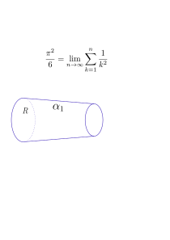
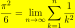
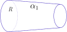

# Install locally and use `inkscape + $\LaTeX$` to draw math illustration  (result is `.svg` file)

To draw math illustration, it is good to use `inkscape`. The $\LaTeX$ may be used to write Greek letters or formula.

However, `inkscape` inside Docker container seems slow, so ***install inkscape directly to the localhost***. And, to enable writing $\LaTeX$ formula to the svg, ***install $\LaTeX$ locally also***.

## Install `MacTeX` $\LaTeX$ locally (NOT in container)

### Make sure there is no $\TeX$ system installed using `brew`

Execute below commands to check whether there is $\TeX$ installed using `brew`.

```bash
arch -x86_64 /usr/local/bin/brew list | grep tex
arch -arm64 /opt/homebrew/bin/brew list | grep tex
```

### If some $\TeX$ system is already installed, then remove it

> \[!TIP]
> See [TeX User Grup (TUG) uninstallation page](https://www.tug.org/mactex/uninstalling.html).\
> See also [mac で tex環境を削除 (***REMOVE ALL, CLEAN***)](https://qiita.com/tetsuo_jp/items/04a66b8f42946b5c5a5a).

Execute below command to confirm/remove `basictex`, `ghostscript`, and `imagemagick`, which may be installed using `brew`. If needed, use `.dmg` package to install `ghostscript` or `imagemagick`.

```bash
brew uninstall basictex
brew list --cask | grep tex
brew list --cask | grep ghost
brew list | grep ghost
brewx86 list | grep ghost
brew uninstall --force imagemagick
brew uninstall ghostscript (Better: brew uninstall --ignore-dependencies ghostscript)
brewx86 uninstall --force imagemagick
brewx86 uninstall ghostscript
```

> \[!CAUTION]
> Doing `brew uninstall --force imagemagick` might erase `python3.9`. To install it again, execute:
>
> ```bash
> brewx86 install python@3.9
> ```

### Uninstall, remove all of `MacTeX` (& also its largest piece, `TeX Live`)

Following the [TIP for uninstalling $\TeX$](#if-some-tex-system-is-already-installed-then-remove-it), execute belows (confirm first the config file location from `/usr/local/texlive/2024/texmf.cnf`):

```bash
sudo rm -rf /usr/local/texlive
rm -rf ~/Library/texmf
rm -rf ~/Library/texlive
rm -rf ~/Library/TeXShop
sudo rm -rf /Applications/TeX
sudo rm -rf /Library/TeX/
```

### Install `MacTeX`

Install MacTeX from [The MacTeX-20?? Distribution](https://tug.org/mactex/). From [MacTeX download page](https://tug.org/mactex/mactex-download.html), download `MacTeX.pkg`. Read this download page!

By standard `MacTeX` installation, `ghostscript` will be installed. So, no need to install `ghostcript` using `brew`, NOR remove the old version of `ghostscript`. After installation, check whether ghostscript is updated (`gs --version`).

Use ***TeX Live Utility*** in `/Applications/TeX` to update programs to the current version.

## Install `inkscape` locally (NOT in container)

### Download inkscape `Inkscape-1.4.3_arm64.dmg`

Go to [inkscape website](https://inkscape.org/), then download `Inkscape-1.4.3_arm64.dmg` and double-click.

### Make `inkscape` started from icon know the path to `pdflatex`

If `inkscape` is started from icon, and because `inkscape` does not know the path to `pdflatex` etc., then $\LaTeX$ formula cannot be used in `inkscape`. So, it need to be ***started as a command line from terminal where the path to*** `pdflatex` ***is known***:

```bash
open -a /Applications/Inkscape.app
```

Then, inside `inkscape` GUI, click *Extension → Text → Formula 公式 (pdflatex)* to insert $\LaTeX$ formula.

> \[!WARNING]
> *Extension → Rendering → Mathematics* *CAN NOT* insert $\LaTeX$ formula.\
> Use *Extension → Text → Formula 公式 (pdflatex)* to insert $\LaTeX$ formula.

To enable `inkscape` started from icon (contrary to be started from command line by `open -a ...` above) and able to use $\LaTeX$ formula, then path to the `pdflatex` must be set to `inkscape`. Do the setting as below, that is putting a link to `pdflatex` in the binary directory known by `inkscape`:

```bash
cd /Applications/Inkscape.app/Contents/Resources/bin
ln -s `which latex` .
ln -s `which pdflatex` .
ln -s `which dvips` .
# ln -s `which pstoedit` .
```

## `inkscape` flow for creating `.svg` file to be included in `.md` file or $\LaTeX$

There is 2 types of `svg` file, that is:

1. `Source inkscape svg` file (an `svg` file edited using `inkscape`; maybe edited later),
2. `Exported plain svg` file (an `svg` file exported by `inkscape`; NOT to be edited further; FINAL READ-ONLY `plain svg`).

First, create the `Source inkscape svg` file. Then, using `inkscape`, select the region-of-interest, and export to `Exported plain svg` file. Include the `Exported plain svg` file to `.md` or $\LaTeX$.

### Initial setting when creating svg file

#### Size in milimeter

DOING.

### Create the `Source inkscape svg` file (MAYBE EDITED LATER)

The `Source inkscape svg` is like below, is having a transparent background, with A4 size:


### Set `Exported plain svg` image background to white (NOT TO BE EDITED, FINAL READ-ONLY FILE; ***after doing this, the `plain svg` file CAN NOT be edited using `inkscape`***)

By default, the background of `Exported plain svg` file is transparent. This will make it look bad for a dark theme browser. So, we need to change the background color to white, but in svg, it seems *NOT* possible.

Refering to [stackoverflow's background color of svg root-element](https://stackoverflow.com/a/69899106), we can add a very big circle (below) as the first child of svg tag:

```svg
<circle r="1e5" fill="red"/>
```

Use text editor to edit the svg (which is a text file), so the final svg file will look like this:

```svg
<?xml version="1.0" encoding="UTF-8"?>
<svg version="1.1" xmlns="http://www.w3.org/2000/svg">
  <circle r="1e5" fill="white"/>
  <!-- circle must be the first child, so it is placed right after svg tag -->
  ...
</svg>
```

> \[!NOTE]
> It seems using `inkscape` *File → Document Properties → Display (表示)* CANNOT change the background color to white. It keeps transparent.

But be careful, as stated above, this `plain svg` CAN NOT be edited using `inkscape` anymore:
> \[!CAUTION]
> Due to the size of *very big* background circle object, this circle will prevent other objects selection inside `inkscape` UI. Re-export again from the source `inkscape svg`, when needed.

Below is exported as plain svg, then the background is set to yellow circle:\


Below is exported as plain svg, then the background is set to white circle:\


## `inkscape` tutorial

`Inkscape` is used to draw a math conceptual illustration, which possibly include $\LaTeX$ formula. The flow for creating the source `.svg` file (and exporting to `plain svg` file for inclusion) is mentioned [above](#inkscape-flow-for-creating-svg-file-to-be-included-in-md-file-or-latex).

See this, this, and this. DOING.
