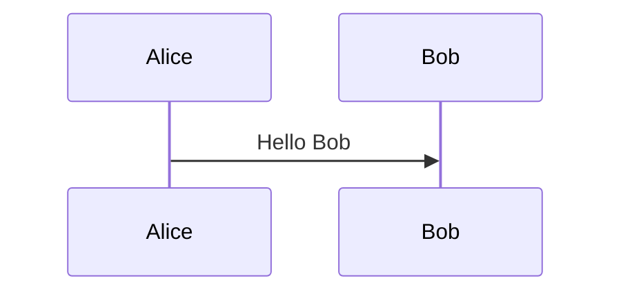
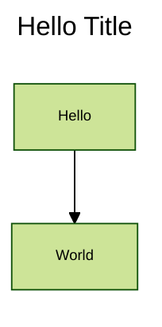
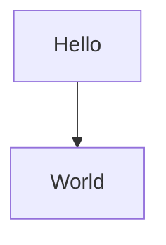
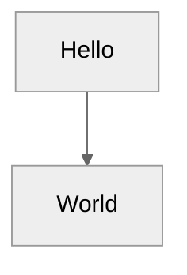
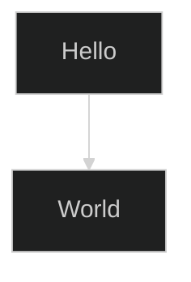
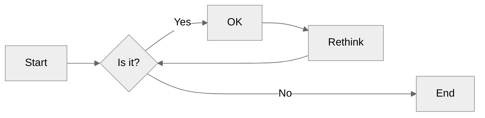
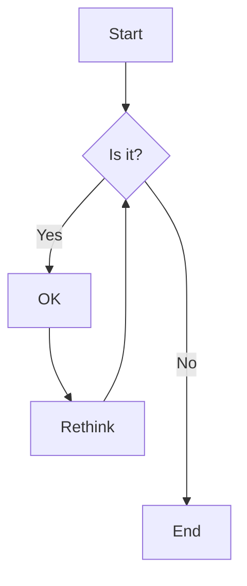
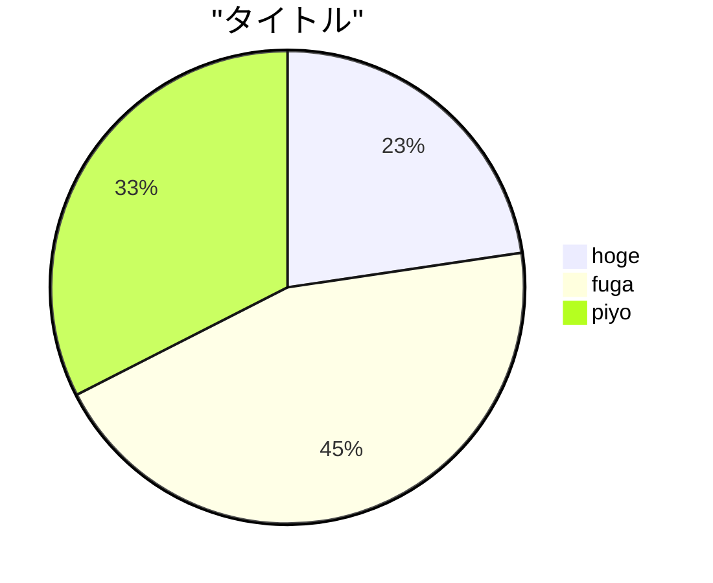

# Use `mermaid` notation to create diagram in Markdown (result is `.md` text file)

`mermaid` is a markdown-inspired (so, it is a text-based) notation (programming language) to draw diagram. `mermaid` blends naturally with markdown.

But, there is a condition here, the renderer must support rendering mermaid. For example, when editing markdown in "github.dev", the "preview editor" will not render the mermaid-diagram, eventhough it is correctly rendered in "github.com".

So, to have a correct mermaid preview during editing, it is better to edit the markdown source file using Visual Studio Code (vscode).

## Editing/previewing markdown in vscode

### vscode extension for markdown (must install & use)

* vscode-pdf
* Markdown All in One (To preview md, print md to html)
  - Insert table of contents (TOC)<!-- markdownlint-disable-line MD004 -->
    + github can creates TOC (by clicking Outline menu icon at top right) for markdown docs, so no need for github docs.<!-- markdownlint-disable-line MD004 -->
  - [How to suppress toc detection](https://markdown-all-in-one.github.io/docs/guide/table-of-contents.html#suppressing-toc-detection)<!-- markdownlint-disable-line MD004 -->
    + Add a comment `<!-- omit in toc -->` at the end of a heading or above it.<!-- markdownlint-disable-line MD004 -->
* Markdown Preview Enhanced
* Markdownlint

### References on writing markdown on github

Access the [(rendered) markdown syntax explanation](https://docs.github.com/en/get-started/writing-on-github/getting-started-with-writing-and-formatting-on-github/basic-writing-and-formatting-syntax) and its [markdown source text file](https://docs.github.com/api/article/body?pathname=/en/get-started/writing-on-github/getting-started-with-writing-and-formatting-on-github/basic-writing-and-formatting-syntax), from browser, show side-by-side.

> \[!TIP]
> Press `@` to show candidates of people to mention.\
> Press `#` after link `[ ](` to show candidates of anchor (heading).

## More tips on writing/printing markdown

* [Mermaid使い方メモ](https://qiita.com/opengl-8080/items/a275119c5ff3012ff23a)
* $\TeX$ (`$\TeX$`) math is also OK to be previewed!!!! (Surround with single `$` for inline, double `$$` for display/stand alone math equation)

  ```LaTeX
  $$\int_{-\infty}^{\infty} e^{-x^2} = \sqrt{\pi}$$
  ```

  $$\int_{-\infty}^{\infty} e^{-x^2} = \sqrt{\pi}$$
* In vscode, right click at the preview to open context menu, then export to html (cdn hosted)
* [Markdown Preview Enhanced usage](https://shd101wyy.github.io/markdown-preview-enhanced/#/)
* [Mermaid notation syntax](https://mermaid.js.org/intro/syntax-reference.html)
* [For flowchart](https://mermaid.js.org/syntax/flowchart.html)
* `Mermaid Live Editor`, just like go playground

> \[!TIP]
> Use `Mermaid Live Editor` to convert mermaid markdown text to `.svg`. In the *Action* download as `.svg`. However, the svg file is targeting browser only. So, open with browser then export to pdf with the browser if needed.

## Some mermaid examples

### mermaid's sequence diagram

````markdown

````


### mermaid's flowchart

````markdown

````


````markdown

````


Neutral theme is good for black and white printing.

````markdown

````


````markdown

````


````markdown

````


````markdown

````


### mermaid's pie chart

````markdown

````


