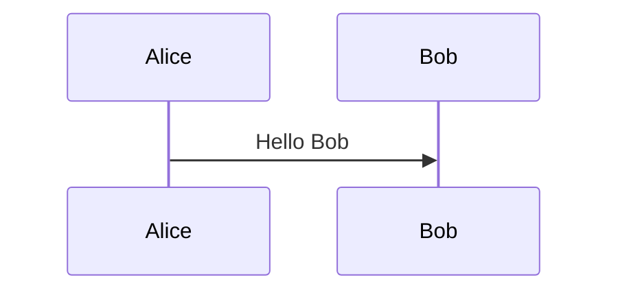

# `mermaid`記法 (mermaid notation)

`mermaid` is a markdown-inspired (so, it is a text-based) notation (programming language) to draw diagram. `mermaid` blends naturally with markdown.

But, there is a condition here, the renderer must support rendering mermaid. For example, when editing markdown in "github.dev", the "preview editor" will not render the mermaid-diagram, eventhough it is correctly rendered in "github.com".

So, to have a correct mermaid preview during editing, it is better to edit the markdown source file using Visual Studio Code (vscode).

## Editing/previewing markdown in vscode

### vscode extension for markdown (must install & use)

* vscode-pdf
* Markdown All in One (To preview md, print md to html)
  - Insert table of contents (TOC)
    + github can creates TOC (by clicking Outline menu icon at top right) for markdown docs, so no need for github docs.
  - [How to suppress toc detection](https://markdown-all-in-one.github.io/docs/guide/table-of-contents.html#suppressing-toc-detection)
    + Add a comment `<!-- omit in toc -->` at the end of a heading or above it.
* Markdown Preview Enhanced
* Markdownlint

### References on writing markdown on github

Access the [(rendered) markdown syntax explanation](https://docs.github.com/en/get-started/writing-on-github/getting-started-with-writing-and-formatting-on-github/basic-writing-and-formatting-syntax) and its [markdown source text file](https://docs.github.com/api/article/body?pathname=/en/get-started/writing-on-github/getting-started-with-writing-and-formatting-on-github/basic-writing-and-formatting-syntax), from browser, show side-by-side.

> \[!TIP]
> Press `@` to show candidates of people to mention.
> Press `#` after link `[ ](` to show candidates of anchor (heading).

## Some mermaid examples

````markdown

````


