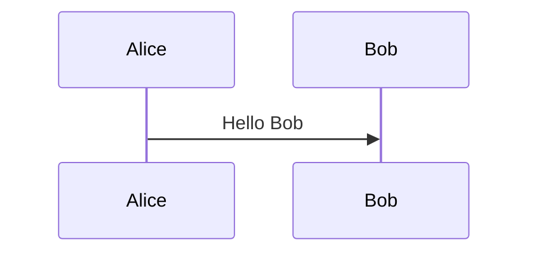

# mermaid記法 (mermaid notation)

mermaid is a markdown-inspired (so, it is a text-based) notation (programming language) to draw diagram. mermaid blends naturally with markdown.

But, there is a condition here, 

````markdown

````


